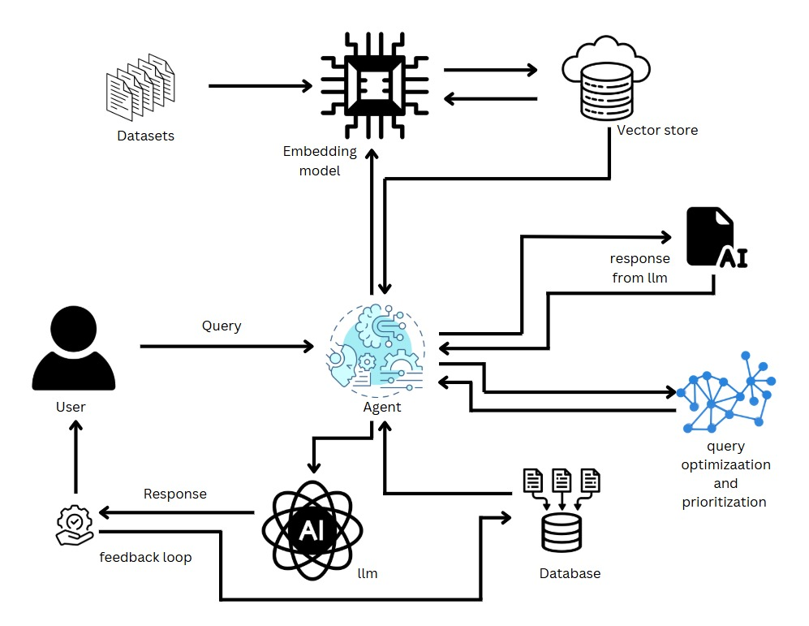

## "NYD HACKATHON - AI-Powered Knowledge Retrieval with Agentic RAG"

## Table of contents

- [Overview](#overview)
- [Architecture Diagram](#my-process)
- [About RAG Implmentation](#about-rag-implementation)
- [Built with](#built-with)
- [Installation](#installation)
- [Result Analysis](#resultanalysis)
- [Offline RAG Molde](#offline)
- [Author](#author)


## Overview
- This is a solution to the [The NYD Hackathon](https://unstop.com/hackathons/the-nyd-hackathon-2025-the-yoga-vivek-group-1281825). 

- Our model is a **Agentic Retrieval-Augmented Generation (RAG) system**, designed to provide contextual and insightful responses from the Bhagavad Gita and Patanjali Yoga Sutra datasets. Leveraging a **multi-agent architecture**, it integrates **semantic search using Pinecone** with advanced natural language generation powered by the **Llama 3.3 model** through the Ollama API. The system includes a feedback loop to maintain conversational coherence, ensuring continuity and accuracy in responses. Optimized for efficiency and scalability, the model combines cutting-edge AI with a user-centric design to deliver an engaging and meaningful learning experience.

## Architecture Diagram



---

## Detailed Explanation of the RAG Pipeline

  ### 1. User Query (Input Stage)
  - **Description**: The pipeline begins with the user submitting a query (e.g., a question or request for specific information).
  - **Purpose**: This serves as the input to initiate the retrieval and generation process.
  - **Example**: A user might ask, "Who was the king from Kashi who fought in the Mahabharata war?"

  ---

  ### 2. The Agent (Central Orchestrator)
  - **Description**: The agent acts as the core controller of the RAG pipeline. It is responsible for interpreting the user query and coordinating between various components.
  - **Key Responsibilities**:
    - Directs the query to the relevant modules, such as the vector store or database.
    - Retrieves relevant context or data.
    - Sends the context and query to the LLM for generating responses.
  - **Advantage**: Ensures modularity and flexibility in query processing.

  ---

  ### 3. Embedding Model and Vector Store
  #### a. Embedding Model
  - **Description**: Converts raw datasets into dense vector representations using a Sentence embeddings.
  - **Process**:
    - Each dataset entry (e.g., documents, judgments, or text files) is embedded into a high-dimensional vector space.
    - These embeddings capture the semantic meaning of the text, making it easier to perform similarity searches.
  - **Tools**: sentence transformer

  #### b. Vector Store
  - **Description**: A database that stores vector embeddings of the datasets, optimized for similarity search.
  - **Purpose**: Enables fast retrieval of semantically similar data points.
  - **Process**:
    - When the user’s query is embedded into a vector, the vector store is queried for the closest matches.
    - Returns the most relevant pieces of information
  - **Tools**: Pinecone.

  ---

  ### 4. Query Optimization and Prioritization
  - **Description**: Before searching the vector store or database, the agent enhances the user query to ensure it retrieves the most accurate and relevant data.
  - **Mechanisms**:
    - **Optimization**: Reformulating the query to match the vocabulary and structure of the stored data.
    - **Prioritization**: Ranking the query results based on relevance, confidence scores, or user preferences.
  - **Benefit**: Reduces ambiguity and improves retrieval accuracy.

  ---

  ### 5. Database Search (Structured Data Retrieval)
  - **Description**: In addition to retrieving data from the vector store, the agent queries structured databases for supplementary information.
  - **Integration**: The results from the database are combined with those retrieved from the vector store to provide comprehensive context.

  ---

  ### 6. Large Language Model (LLM)
  - **Description**: The retrieved data is sent to the LLM, along with the original user query. The LLM processes this input to generate a natural language response.
  - **Key Features**:
    - **Contextual Understanding**: Incorporates retrieved data to generate accurate and context-aware responses.
    - **Natural Language Generation**: Creates human-like, coherent, and informative replies.
  - **Example**: If the retrieved data contains legal judgments, the LLM can synthesize a summary or explanation.
  - **Tools**: Ollama (llama 3.3)

  ---

  ### 7. Feedback Loop (Continuous Improvement)
  - **Description**: A feedback mechanism allows the system to iteratively refine its responses based on user validation or additional input.
  - **Process**:
    - The user reviews the generated response and provides feedback
    - The feedback is incorporated into future responses to improve accuracy and user satisfaction.
  - **Advantage**: Ensures that the system adapts over time and learns from errors or user preferences.

  ---

  ### 8. Response Delivery
  - **Description**: The agent delivers the final response to the user in a user-friendly format 
  - **Purpose**: To ensure that the output is both actionable and easy to understand.

  ---

  ### 9. Datasets and Model Integration
  #### Datasets:
  - The pipeline is powered by diverse datasets, including  case histories, and domain-specific knowledge.
  - These datasets are pre-processed, embedded, and stored for retrieval.

  #### Models:
  - The embedding model creates the vector representations.
  - The LLM processes queries and retrieved data for natural language generation.
  - Auxiliary models, if any, can assist in specific tasks like sentiment analysis, keyword extraction, or multi-modal understanding.

  ---

  ### Advantages of This RAG Pipeline
  1. **Efficient Retrieval**: Combines structured and unstructured data retrieval for comprehensive responses.
  2. **Dynamic Query Handling**: Handles both ambiguous and specific queries through query optimization.
  3. **Scalability**: Modular design allows easy integration of new datasets, models, or features.
  4. **Continuous Learning**: Feedback loop ensures the system improves over time.
  5. **User-Centric Design**: Delivers precise, contextually relevant, and actionable responses.

---

## Built with
- `Programming Languages`: Python
- `Machine Learning Models`: Llama 3.3 70B, Ollama API
- `Vector Database`: Pinecone
- `Tools`: SQLite3
- `Development Environment`: Local inference setup, API integration, multi-agent Agentic RAG pipeline.


## Installation

### Prerequirements
  - `python3.11`

### Installation steps

  ```
    https://github.com/Sabari2005/NYD_Hackathon.git
    NYD_Hackathon
    cd model
  ```
  ```
  run all the cells in the rag.ipynb
  ```
  - the rag.ipynb has the detailed steps and provides the output as a `JSON` format and saved in the `output_folder`


## Testing and Results

- For Bhagavad Gita, we tested approximately 18 questions, and for Patanjali Yoga Sutras, we tested around 28 questions, totally **46 questions**.  
- Our model provided correct answers for every question tested, demonstrating its accuracy and reliability.
- our test question is given in the `bagavad_gita_test_question.csv` and `Patanjali_test_question.csv` 
- the output for each test is saved as a JSON file inside the **bagavadgita** and **yogasutra** folder

## Performance Metrics for the System

### Response Time (Latency)
- **Target**: < 1 second for semantic search and query refinement.
- **Breakdown**:
  - **Pinecone Retrieval**: ≤ 300ms for embedding search and metadata extraction.
  - **Llama Response Generation**: ≤ 500ms for query refinement and response creation.
  - **Feedback Loop Integration**: ≤ 200ms.

### Accuracy
- **Query Retrieval (Pinecone)**: ≥ 95% of queries should return relevant results in the top 3 matches.
- **Final Response (Llama)**: ≥ 95% of responses should provide correct information from the Bhagavad Gita or Patanjali Yoga Sutra.
- **Refinement Impact**: Refined queries should improve retrieval accuracy by at least 10% compared to raw queries.

### User Satisfaction
- **Target**: ≥ 90% positive feedback from users on the relevance and completeness of answers.
- **Measurement**: Based on user ratings collected over a defined period (e.g., post-interaction surveys).

### Hallucination Rate
- **Target**: ≤ 2% of responses should include fabricated or irrelevant content.
- **Measurement**: Manually evaluate a sample of 100 responses.

### Completeness
- **Target**: ≥ 98% of valid responses should include all expected elements (Book Name, Chapter, Verse, Sanskrit, and Detailed Explanation).

### Query Refinement Impact
- **Target**:
  - Refined queries should improve **Recall@3** by ≥ 5% compared to unrefined queries.
  - Retrieval speed should remain unaffected or increase by ≤ 10%.

### End-to-End System Performance
- **Latency**: Total time for query processing and response generation ≤ 1 second.
- **Consistency**: ≥ 95% of similar queries should yield consistent answers.

### Error Rate
- **Target**: ≤ 2% of queries result in incomplete or incorrect answers.

### Scalability
- **Throughput**: System should handle ≥ 1000 concurrent queries without significant degradation in performance.


## Screenshots


## Offline implementation of RAG using Ollama 

- In the `rag2Ollama.ipynb` file we have implemented the **offline llama 3.3 70b model** for our Agentic Rag pipeline 
- But this model requires High end GPU because the llama offline model is **high gpu intensive model**
- this implementation gives us more faster responses than a api endpoint   

### Installation Steps 

- open the [ollama website](https://ollama.com/download/linux
) 
- copy the code for linux and run it in the terminal
  
  ```
  curl -fsSL https://ollama.com/install.sh | sh
  ```
- After the ollama is downloaded run the llama 3.3
  ```
  ollama run llama3.3
  ```
- now our RAG pipline can acces te llama3.3 in offline 
- run the cells in the **rag2Ollama.ipynb**

## Author

- Sabari Vadivelan S (Team Leader) - Contact Gmail [sabari132005@gmail.com]()
- Uvarajan D (Member 2)

